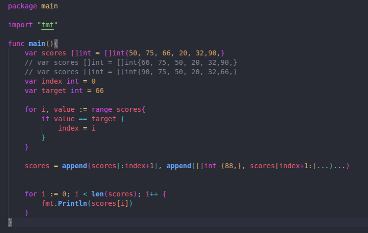
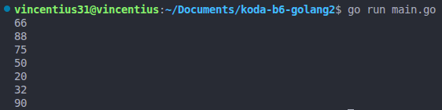
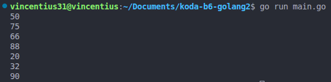
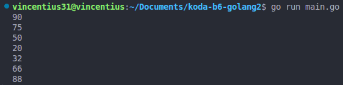

# Go Language Program: Insert Number in the Slice Using Slice Partitioning

Aplikasi ini merupakan aplikasi latihan memasukan angka dalam array dengan metode slice partitioning. Berikut merupakan kode dari aplikasi ini:

## Studi Kasus
1. Diberikan sebuah slice:

    scores := []int{50, 75, 66, 20, 32, 90}

2. Tugas:

    -. Menyisipkan angka 88 setelah angka 66 menggunakan slice partitioning

    -. Menampilkan setiap nilai score satu per satu

## Konsep yang Digunakan:

1. Slice Partitioning

    Teknik ini membagi slice menjadi beberapa bagian:

        scores[:index+1]   → bagian sebelum & termasuk 66
        []int{88}          → nilai yang disisipkan
        scores[index+1:]   → bagian setelah 66

    Kemudian digabung menggunakan append.

2. Mencari Index Data

    Dilakukan dengan loop:

    for i, v := range scores {
        if v == 66 {
            index = i
            break
        }
    }

3. Menampilkan Data Slice

    Menggunakan loop biasa:

    for i := 0; i < len(scores); i++ {
        fmt.Println(scores[i])
    }

## Output:

